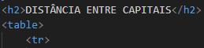

# Projeto - tabela-distancias

Projeto criado como parte avaliativa da disciplina de Fundamentos de Desenvolvomento ministrada pelo professor Leonardo Rocha.

### Descrição

O projeto consiste na composição  de uma tabela que conta com capitais brasileiras e a distância entre essas capitais. As capitais constantes nesse projeto são:

* SÃO PAULO
* TERESINA
* VITÓRIA
* BRASÍLIA
* CAMPO GRANDE
* CUIABÁ

### Resultado do projeto

### table 

* Table - O table consiste um table, com linhas e colunas para melhor visualiza
* Tr - Cria linhas, separando as células da tabela.
 

 
Também foi usado:
 
* td - O td adiciona o conteúdo dentro das célula da tabela.
 

 

 
### Estilização
 
o projeto foi estilizado css. foi criado um arquivo chamado  main.css. nesse arquivo, constam conconfigurações
de estilo apresentadas a seguir:
 
* Estilo de cores - A cor de fundo utilizada no projeto foi definida como segue:

```
.titulo{
    background-color: rgb(255, 0, 0);
}
```
 
Também foi usado:
 
 
 


## Índice

*[Descrição](#descrição)
*[Tecnologias](#tecnologias)
*[Referências](referências)
*[Autor(a)](#autora)


## Tecnologia

* HTML5
* CSS3
* README
* GIT
* Github

## Referências

[Alura](https://www.alura.com.br/artigos/escrever-bom-readme) - Como escrever um README incrível no seu Github

## Autor

O projeto foi desenvolvido pelo grupo:

* Ana Julia Oliveira Viana
* Isabelly dos Reis Santos
* Larissa Aparecida Iuski
* Maria Luíza Farias da Silva
* Mariane Lima Remonte Viana
* Vitor Gabriel de Souza
* Vivian Oliveira Almeida